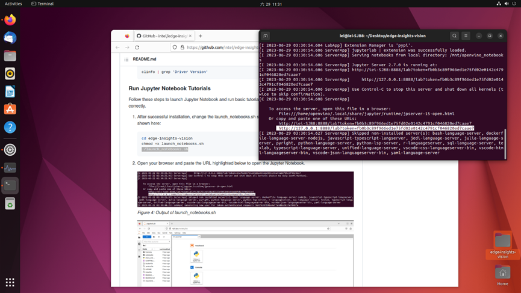
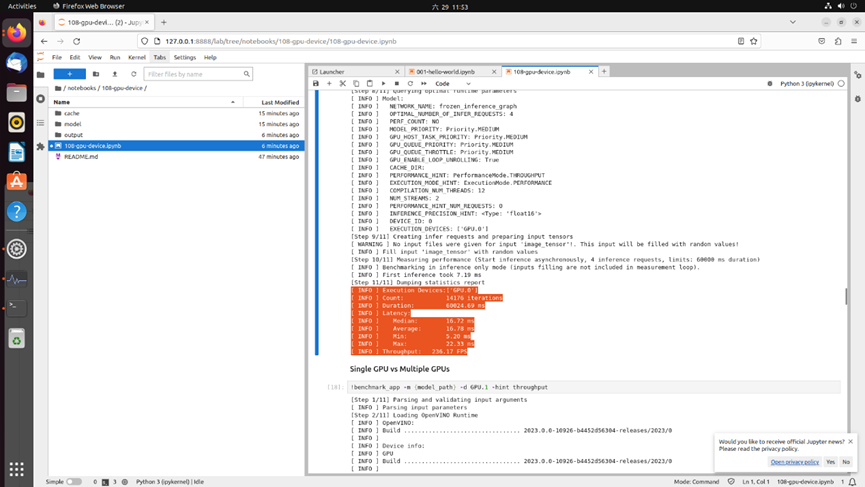

# DGDevKit Installation Guide

Tank-XM811 + A40   
HW: https://www.ieiworld.com/en/product-ns/model.php?II=2   

OS(ubuntu-iot 22.04 desktop):   
link: https://ubuntu.com/download/iot/intel-iot   
    
GPU Driver:   
link: https://github.com/intel/edge-insights-vision   
   
OpenVINO tutorials:   
link: https://github.com/openvinotoolkit/openvino_notebooks
   
# Flash OS   
1. Download below iso file and flash OS(ubuntu-iot 22.04 desktop) images onto pen drive    
link: https://ubuntu.com/download/iot/intel-iot    
      
          
2. insert the pen drive into the USB port    
3. press 'del' and power-on, will boot BIOS  
4. make sure display is IGFX(HDMI), BIOS setting -> primary display -> IGFX  
 
 
5. setup boot priority, BIOS setting -> boot -> boot1-USB(UEFI...)   
 
 
 
6. save and reboot, install ubuntu    
7. when install finish, you can use below command to validate ubuntu version
```shell
lsb_release -a
#Description:  Ubuntu 22.04.02 LTS
   
uname -a   
#5.15.0-1026-intel-iotg 
   
```
 
   
# Install GPU Driver   
1. GPU Driver(EIV):    
link: https://github.com/intel/edge-insights-vision
2. After Ubuntu has been successfully installed, install git and git clone the EIV repository into your Ubuntu system.   
```shell
sudo apt -y install git
git clone https://github.com/intel/edge-insights-vision.git
```
3. Update the package on the system.
```shell
sudo apt-get update
```
4. Install python3-pip.
```shell
sudo apt-get -y install python3-pip
```
4. Change the directory into edge-insights-vision and install the requirements package.
```shell
cd edge-insights-vision
pip3 install -r requirements.txt
```
   
   
    
5. Install EIV. If your system has a dGPU, it will upgrade your kernel to 6.2.8 and your system will reboot during installation.
Please save your work before starting the installation.   
```shell
python3 eiv_install.py
```   
    
6. make sure you were upgrade to kernel 6.2.8    
```shell
uname -a
#Linux iei-SJB8 6.2.8-060208-generic #202303220943 SMP PREEMPT_DYNAMIC Wed Mar 22 13:50:04 UTC 2023 x86_64 x86_64 x86_64 GNU/Linux
```
    
7. Restart your system after the installation is complete.     
*it will stop on install process 57% a long time for download example model.  
base on your status, you also need to enter root password again.    
```shell
python3 eiv_install.py
```   
    
8. when install finish, you will see three modules success information on status    
    
9. validate dGPU driver is work, and resize bar support memory 8G  
```shell
clinfo | grep 'Driver Version'
#Driver Version: 23.17.26241.21
    
lspci -v

#04:00.0 VGA compatible controller: Intel Corporation Device 56b1 (rev 05) (prog-if 00 [VGA controller])
#        Subsystem: Intel Corporation Device 1211
#        Flags: bus master, fast devsel, latency 0, IRQ 141
#        Memory at 81000000 (64-bit, non-prefetchable) [size=16M]
#        Memory at 6000000000 (64-bit, prefetchable) [size=8G]
#        Expansion ROM at 82000000 [disabled] [size=2M]
#        Capabilities: <access denied>
#        Kernel driver in use: i915
#        Kernel modules: i915

```   
 
 
 
  
  
# Run Jupyter Notebook Tutorials   
1. After successful installation, change the launch_notebooks.sh script to executable and run the launcher script as shown here:   
```shell
cd edge-insights-vision
chmod +x launch_notebooks.sh
./launch_notebooks.sh
```   
    
2. Open your browser and paste the URL with token    
   
3. you can try tutorials 001-hello-world and 108-gpu-device      
      
# Tutorials 001-hello-world   
tutorial step   
    
    
    
you also can modify and try to run this tutorial on GPU.1(ARC-A40)   
    
   
# Tutorials 108-gpu-device   
    
It seems have error on 66%, but it still can be work in next step   
    
CPU performance   
    
GPU.0 Performance(iGPU)   
    
GPU.1Performance(dGPU)   
    
result   
    